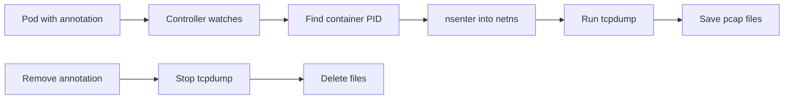

# Kubernetes Packet Capture Controller

A simple DaemonSet controller that captures network traffic from pods using tcpdump. Just add an annotation to your pod and it starts capturing packets.

## How it works



#### The controller runs on each node and only watches pods on that node. When you annotate a pod with `tcpdump.antrea.io: "5"`, it:

1. Finds the container's process ID by scanning `/proc`
2. Uses `nsenter` to enter the container's network namespace
3. Runs tcpdump to capture packets
4. Saves files as `/var/log/antrea-captures/capture-<namespace>-<pod>.pcap`

When you remove the annotation, it stops tcpdump and cleans up the files.

## Setup

```bash
./scripts/setup.sh
```

## Usage

```bash
# Start capturing (max 5 files)
kubectl annotate pod test-pod tcpdump.antrea.io="5"

# Find the controller pod
NODE=$(kubectl get pod test-pod -o jsonpath='{.spec.nodeName}')
CONTROLLER=$(kubectl get pod -l app=packet-capture-controller \
  --field-selector spec.nodeName=$NODE -o jsonpath='{.items[0].metadata.name}')

# Check files
kubectl exec $CONTROLLER -- ls -lh /var/log/antrea-captures/

# Copy pcap file
kubectl cp $CONTROLLER:/var/log/antrea-captures/capture-default-test-pod.pcap0 ./capture.pcap

# Analyze
tcpdump -r ./capture.pcap -n

# Stop capturing
kubectl annotate pod test-pod tcpdump.antrea.io-
```
## Cleanup

```
./scripts/cleanup.sh
```